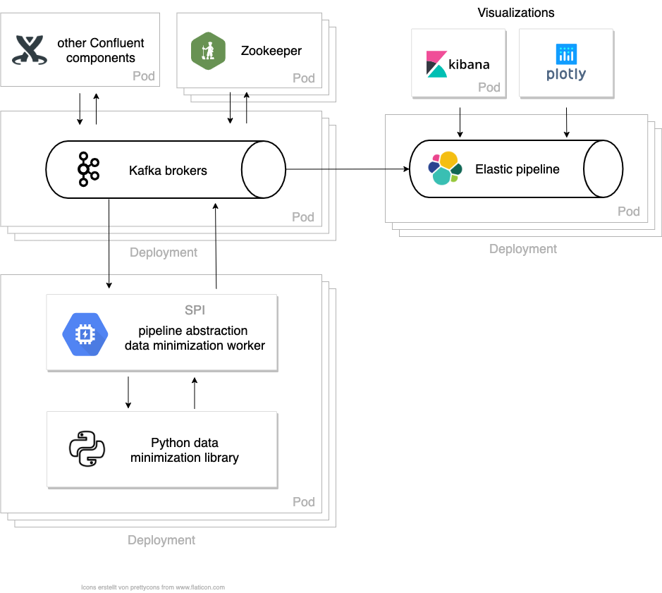

# data-minimization helm charts

The helm chart provided in this repo allows you to deploy tools from the [peng-data-minimization org](https://github.com/peng-data-minimization) on Kubernetes.

Currently, we provide charts for the following tools:

- [Streaming Provider Interface (SPI)](https://github.com/peng-data-minimization/kafka-spi)

## Architecture



## Deployment

Add the helm repo:
```
$ helm repo add dm-helm-charts https://peng-data-minimization.github.io/helm-charts
```

Install the SPI worker:
```
$ helm install dm-spi dm-helm-charts/spi -f PATH_TO_YOUR_SPI_CONFIG.yaml
```

Install the complete data minimization pipeline with the SPI worker, a Confluent Kafka stack, Elasticsearch, Kibana for visualizations and Prometheus and Grafana for monitoring:
```
$ helm install dm-pipeline dm-helm-charts/data-minimization-pipeline -f PATH_TO_YOUR_SPI_CONFIG.yaml
```
Note that when installing the complete pipeline the worker SPI config yaml has to be prefixed with a top-level `spi:` key.

Run `kubectl get pods` to make sure that pods have been started correctly.

To deploy the pipeline without any spi worker, just remove any spi worker tasks in the values file (set `spi.tasks: []`).

## Configuration

For more information on the configuration, refer to the [SPI chart](./subcharts/spi/README.md) documentation or the [kafka-spi repository](https://github.com/peng-data-minimization/kafka-spi).


## Development

To install the SPI worker chart from source run:
```
$ helm install spi subcharts/spi/ -f PATH_TO_YOUR_SPI_CONFIG.yaml
```

To install the data minimization pipeline chart from source run:
```
$ helm dependency update .
$ helm install dm-pipeline . -f PATH_TO_YOUR_SPI_CONFIG.yaml
```

To generate a `README.md` documentation for the chart's `values.yml` run:
```
$ helm-docs
```
