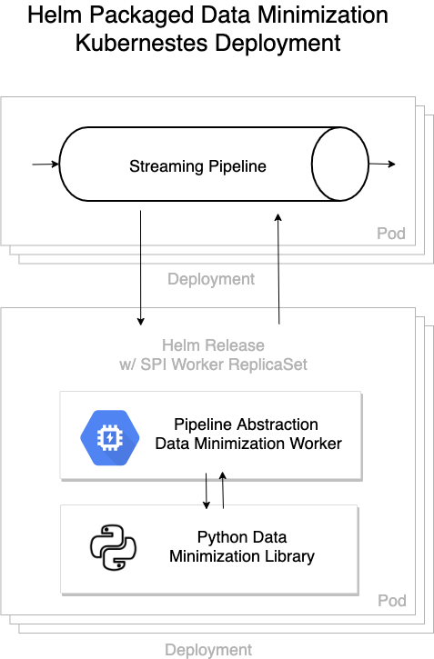
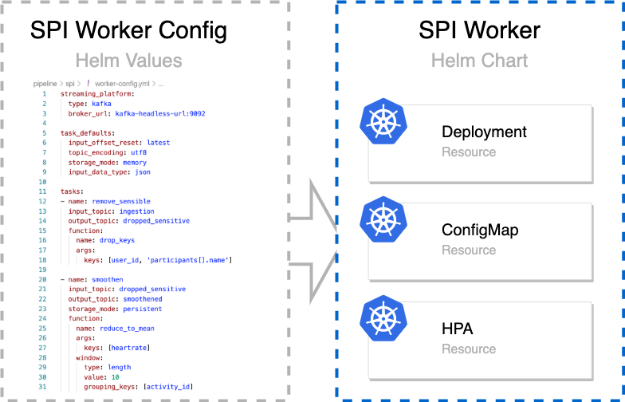

# spi

A Helm chart for the data minimization streaming platform interface

## Mode of Operation

## Configuration

The SPI Chart is being configured with a data minimization worker tasks config as a helm `values.yaml`.
For more configuration options see the [dm-spi](https://github.com/peng-data-minimization/dm-spi#configuration).

 </td>

## Values

| Key | Type | Default | Description |
|-----|------|---------|-------------|
| affinity | object | `{}` |  |
| autoscaling.enabled | bool | `false` |  |
| autoscaling.maxReplicas | int | `100` |  |
| autoscaling.minReplicas | int | `1` |  |
| autoscaling.targetCPUUtilizationPercentage | int | `80` |  |
| image.pullPolicy | string | `"Always"` |  |
| image.repository | string | `"tubpeng/kafka-data-minimization-spi"` |  |
| image.tag | string | `"latest"` |  |
| ingress.annotations | object | `{}` |  |
| ingress.enabled | bool | `false` |  |
| ingress.hosts[0].host | string | `"chart-example.local"` |  |
| ingress.hosts[0].paths | list | `[]` |  |
| ingress.tls | list | `[]` |  |
| nodeSelector | object | `{}` |  |
| podAnnotations | object | `{}` |  |
| podSecurityContext | object | `{}` |  |
| replicaCount | int | `1` |  |
| resources | object | `{}` |  |
| securityContext | object | `{}` |  |
| service.port | int | `80` |  |
| service.type | string | `"ClusterIP"` |  |
| serviceAccount.annotations | object | `{}` |  |
| serviceAccount.create | bool | `false` |  |
| serviceAccount.name | string | `""` |  |
| streaming_platform.broker_url | string | `""` |  |
| streaming_platform.type | string | `"kafka"` |  |
| task_defaults.input_data_type | string | `"json"` |  |
| task_defaults.input_offset_reset | string | `"earliest"` |  |
| task_defaults.storage_mode | string | `"memory"` |  |
| task_defaults.topic_encoding | string | `"utf8"` |  |
| tasks | list | `[]` |  |
| tolerations | list | `[]` |  |

Please note that there are more, optional configuration options. Please refer to the [values.yaml](values.yaml) for all configuration details.